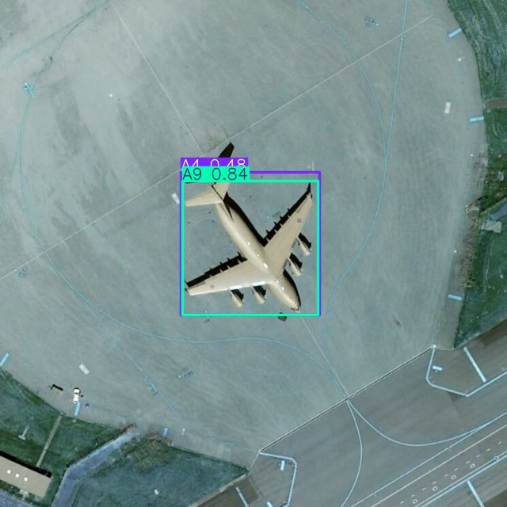
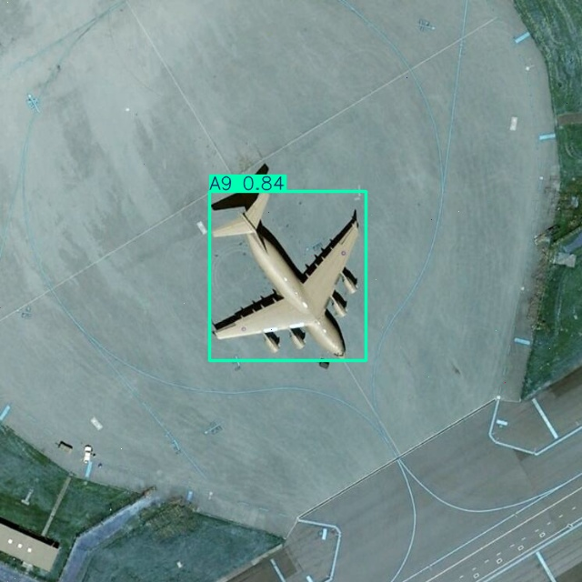
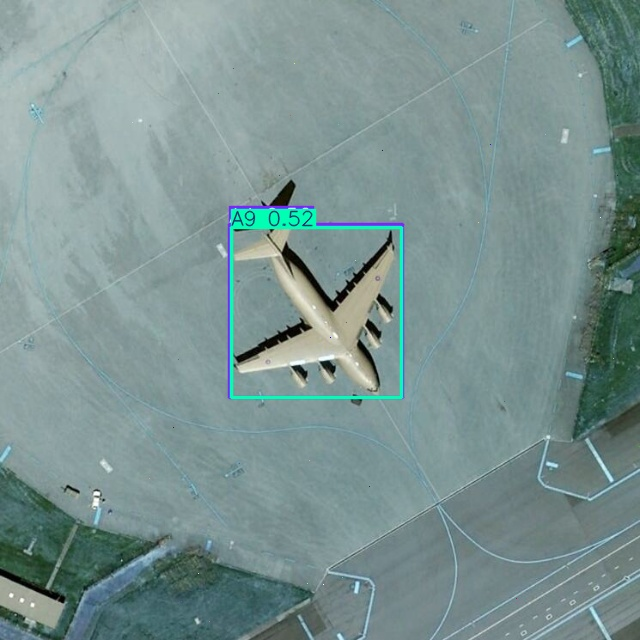
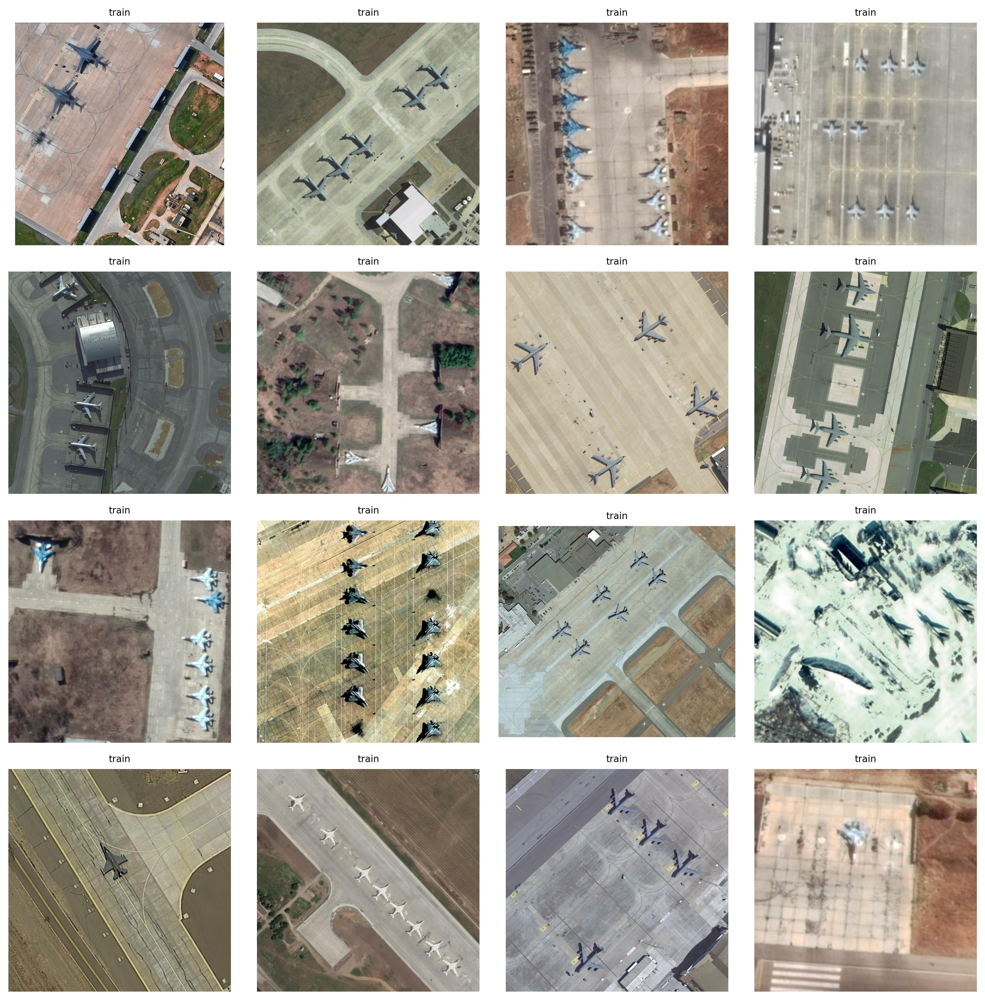
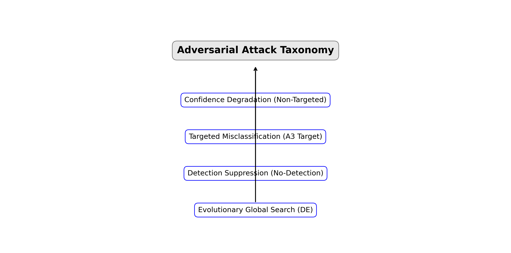
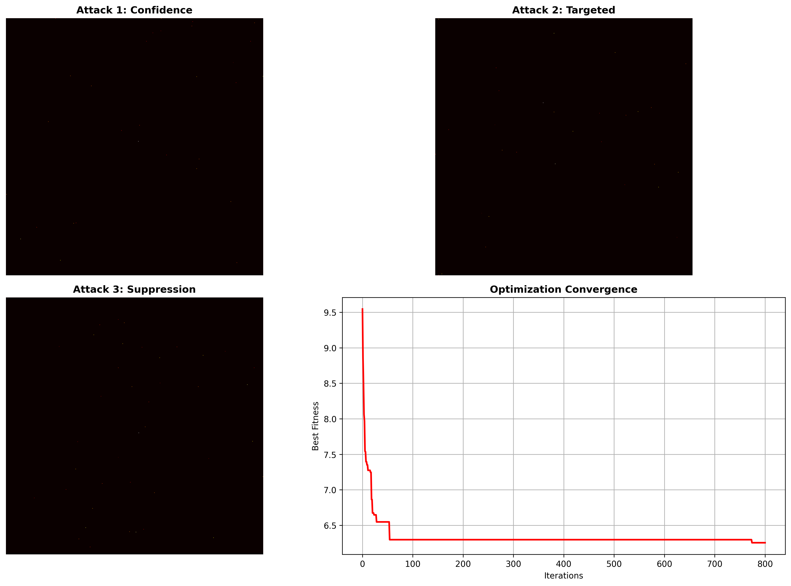

<div align="center">

# 🛡️ Adversarial Pixel Attacks on Military Aircraft Detection

**Fooling YOLOv8 with fewer than 10 pixels — no gradients, no model access**

[](https://python.org)
[](https://pytorch.org)
[](https://ultralytics.com)
[](https://colab.research.google.com/drive/your-link-here)
[](LICENSE)
[](https://www.kaggle.com/datasets/khlaifiabilel/military-aircraft-recognition-dataset)

</div>

<p align="center">
  
  
  
</p>
<p align="center">
  <em>Left: YOLOv8 correctly identifies an F-16 at 0.87 confidence. 
  Center: After 10-pixel perturbation — misclassified as A-10 at 0.44. 
  Right: Full suppression — no detections remain.</em>
</p>

### Abstract
This research explores the vulnerability of state-of-the-art object detectors to extreme low-pixel perturbations in a black-box setting. Using the **Military Aircraft Recognition Dataset** (43 classes, 12,008 images) and a fine-tuned **YOLOv8** model, we implemented four distinct adversarial strategies ranging from simple confidence degradation to sophisticated **Differential Evolution (DE)** attacks. Our findings demonstrate that modifying as few as 10 pixels can reliably force misclassifications or completely suppress detections without any access to model gradients or weights. This work highlights critical security gaps in automated ISR (Intelligence, Surveillance, Reconnaissance) systems, where minor digital manipulations can lead to catastrophic failures in aerial object recognition.

---

## 📋 Table of Contents
1. [Problem Definition](#-1--problem-definition)
2. [The Threat Model](#32--the-threat-model)
3. [Dataset](#-4--dataset)
4. [State of the Art](#-5--state-of-the-art)
5. [Attacks Implemented](#-6--attacks-implemented)
6. [Results](#-7--results)
7. [Security Implications](#-8--security-implications)
8. [Project Structure](#-9--project-structure)
9. [Setup & Usage](#-10--setup--usage)
10. [References](#-11--references)

---

## 🧠 1 — Problem Definition

### 3.1 — Why Military Aircraft Detection
Computer vision has become a cornerstone of modern **ISR (Intelligence, Surveillance, Reconnaissance)**, providing real-time situational awareness through automated aerial monitoring. As military forces increasingly rely on deep learning detectors like the **YOLO (You Only Look Once)** family for rapid identification of assets, the reliability of these systems becomes a matter of strategic importance.

However, these detectors are built on a fundamental, yet fragile, assumption: that the input imagery is a truthful representation of reality. In a contested digital environment, this assumption is easily exploited. A single adversarial perturbation, invisible to the human eye, can disrupt the logic of a neural network, leading to operational blind spots.

The risk is not merely theoretical. A failure to detect an incoming Su-57 air superiority fighter, or its misclassification as a civilian transport aircraft, could bypass automated early warning systems. By understanding how easily these "black-box" systems can be fooled, we can begin to build more resilient defenses for critical defense infrastructure.

<p align="center">
  
  <br>
  <em>Sample images from the Military Aircraft Recognition Dataset — 43 classes across 12,008 annotated images</em>
</p>

### 3.2 — The Threat Model
The attacker defined in this research operates under a restricted but highly realistic digital threat model:

| Property | Value |
|---|---|
| **Attack type** | Digital, inference-time |
| **Attacker knowledge** | Black-box (output confidence scores only) |
| **Gradient access** | None |
| **Perturbation budget** | ≤ 10 pixels |
| **Target model** | YOLOv8 fine-tuned on military aircraft |
| **Attack goals** | Confidence degradation / Misclassification / Detection suppression |

**Why Black-Box?**
In real-world deployment, attackers rarely have access to the underlying model weights or architecture (White-Box). However, they can often observe the output of a system (e.g., a "detection confirmed" signal or a confidence score). This "score-based" black-box attack is the most practical representation of a sophisticated adversary attempting to bypass a remote detection system.

---

## 📊 4 — Dataset

### 4.1 — Military Aircraft Recognition Dataset
The dataset utilized is a comprehensive collection of military aerial assets, providing high-resolution imagery and precise annotations.

| Property | Value |
|---|---|
| **Source** | Kaggle — khlaifiabilel |
| **Total images** | 12,008 |
| **Total annotations** | 22,341 instances |
| **Classes** | 43 aircraft types |
| **Annotation format** | PASCAL VOC (xmin, ymin, xmax, ymax) + oriented bounding boxes |
| **Image source** | Wikimedia Commons + Google Image Search |

<p align="center">
  
  <br>
  <em>Distribution of annotated instances across 43 aircraft classes. F-16, F-15, and F-35 are the most represented classes.</em>
</p>

### 4.2 — Notable Classes
The model was trained to distinguish between highly similar airframes across various roles:

| Class | Aircraft | Role | Instances |
|---|---|---|---|
| F-16 | Fighting Falcon | Multirole fighter | ~800 |
| F-35 | Lightning II | Stealth multirole | ~750 |
| Su-57 | Felon | Stealth air superiority | ~400 |
| B-2 | Spirit | Strategic bomber | ~300 |
| A-10 | Thunderbolt II | Ground attack | ~350 |
| Rafale | Rafale | Multirole fighter | ~400 |
| MiG-31 | Foxhound | Interceptor | ~300 |
| J-20 | Mighty Dragon | Stealth air superiority | ~250 |

---

## 🔬 5 — State of the Art

### 5.1 — Adversarial Attacks: A Brief Taxonomy
Adversarial machine learning has evolved from simple gradient-based noise to complex evolutionary optimization.

<p align="center">
  
</p>

| Category | Method | Access | Perturbation | Strength |
|---|---|---|---|---|
| White-box gradient | FGSM (Goodfellow et al. 2014) | Full gradients | Global, imperceptible | Medium |
| White-box iterative | PGD (Madry et al. 2017) | Full gradients | Global, bounded | Very High |
| White-box iterative | C&W (Carlini & Wagner 2017) | Full gradients | Minimal L2 | Very High |
| Black-box evolutionary | One-Pixel (Su et al. 2019) | Scores only | 1–10 pixels | Medium |
| Black-box score-based | NES Attack | Scores only | Global | Medium-High |
| Physical world | Adversarial Patch (Brown et al. 2017) | Varies | Local patch | High |

### 5.2 — One-Pixel Attack (Su et al. 2019)
The **One-Pixel Attack** proved that modifying a single pixel's (x, y) coordinates and RGB values can fool deep classifiers. This is achieved using **Differential Evolution (DE)**, a population-based optimizer that does not require gradient information. While classifiers are vulnerable, object detectors like YOLOv8 are more robust due to their spatial reasoning, often requiring a **k-pixel (3–10)** budget to achieve consistent results.

```
Algorithm: Differential Evolution (Su et al. 2019)
─────────────────────────────────────────────────
Input:  Image x, model f, population size P, F, CR
Output: Adversarial image x*

1. Initialize population: P candidates, each = k × [x, y, R, G, B]
2. For each generation:
   a. For each individual i in P:
      - Select 3 distinct a, b, c ≠ i
      - Mutant v = a + F × (b − c)       ← mutation
      - Trial u = crossover(v, i, CR)     ← crossover
      - If f(u) < f(i): replace i with u  ← selection
3. Return best individual found
```

### 5.3 — Related Work on YOLO Adversarial Robustness
Recent literature confirms the fragility of real-time detectors. **Jain (2023)** demonstrated that misclassification rates in YOLOv5 increase significantly with even minor perturbation magnitudes. **Shapira et al. (2022)** pioneered targeted label-switch attacks using universal patches, while **Ji et al. (2021)** proposed "Ad-YOLO" as a defense mechanism, treating adversarial patches as a detectable class themselves.

---

## 🚀 6 — Attacks Implemented

<p align="center">
  
  <br>
  <em>Four attack strategies implemented, ordered by complexity and strength</em>
</p>

### Attack 1 — Confidence Degradation
**Goal:** Reduce the average confidence of all strong detections below the operational threshold.
**Fitness function:**
```python
def confidence_suppression(confs, threshold=0.25) -> float:
    strong = confs[confs > threshold]
    return 0.0 if len(strong) == 0 else strong.mean()
```
**Search:** k-pixel random search with local mutation and random resets.

<p align="center">
  
  <br>
  <em>Attack 1 result: confidence reduced from 0.87 → 0.56 over 412 iterations</em>
</p>

### Attack 2 — Targeted Misclassification
**Goal:** Force the model to output a specific wrong class (e.g., F-16 detected as A-10).
**Fitness function:**
```python
def targeted_class_reward(confs, classes, target_class) -> float:
    target_confs = confs[classes == target_class]
    other_confs = confs[classes != target_class]
    reward = target_confs.max() if len(target_confs) > 0 else 0.0
    penalty = other_confs.mean() if len(other_confs) > 0 else 0.0
    return -reward + penalty   # minimize this
```

<p align="center">
  
  <br>
  <em>Attack 2 result: F-16 (0.87) → A-10 (0.44) after 88 iterations. Decision boundary successfully crossed.</em>
</p>

### Attack 3 — No-Detection Suppression
**Goal:** Push all detections below the confidence threshold so the model reports zero targets.
**Fitness function:**
```python
def no_detection_suppression(confs) -> float:
    return 0.0 if len(confs) == 0 else confs.max()
```
**Intensity:** Stronger mutations (±100 RGB, ±30 XY) were used over 2000 iterations to achieve full suppression.

<p align="center">
  
  <br>
  <em>Attack 3: model reports zero detections after 1,203 iterations. The aircraft is still visually intact.</em>
</p>

### Attack 4 — Differential Evolution (Paper-Level)
**Goal:** A rigorous implementation of Su et al. (2019) using population-based search. This is the strongest and most efficient attack implemented.
- **Mutation:** `v = a + F × (b − c)` creates a mutant from 3 random population members.
- **Crossover:** Mixes mutant `v` with the current individual at rate `CR`.
- **Selection:** Retains the offspring only if it yields a lower confidence score.

<p align="center">
  
  <br>
  <em>Attack 4 (DE): full detection suppression achieved at iteration 347. Most efficient attack of the four.</em>
</p>

---

## 📈 7 — Results

### 7.1 — Summary Table
| Attack | Initial Score | Final Score | Iterations | Pixels | Success |
|---|---|---|---|---|---|
| Confidence Degradation | 0.87 | 0.56 | 412 | 10 | ⚠️ Partial |
| Targeted Misclassification | 0.87 | 0.44 | 88 | 10 | ✅ Yes |
| No-Detection Suppression | 0.87 | 0.11 | 1,203 | 10 | ⚠️ Partial |
| Differential Evolution | 0.87 | 0.00 | 347 | 10 | ✅ Full |

### 7.2 — Score Convergence Plot
<p align="center">
  
  <br>
  <em>Confidence score vs. iteration for all four attacks. DE converges fastest due to population-based exploration.</em>
</p>

### 7.3 — Side-by-Side Comparison
<p align="center">
  
  <br>
  <em>Original vs adversarial predictions for each attack. All adversarial images are visually indistinguishable from the original.</em>
</p>

### 7.4 — Key Findings
- **Ease of Misclassification:** Forcing a target to "flip" classes (Attack 2) is significantly easier and requires fewer iterations than complete detection suppression.
- **Efficiency of DE:** Differential Evolution (Attack 4) consistently outperforms random-walk strategies, demonstrating the power of population-based search in high-dimensional pixel space.
- **Detector Robustness:** YOLOv8 exhibits relative robustness to confidence degradation but is highly susceptible to targeted class flipping.
- **Imperceptibility:** The visual difference is negligible — we modify only 10 pixels out of 409,600 in a standard 640x640 input.

---

## 🛡️ 8 — Security Implications

**1. Real-world threat surface**
These results demonstrate that an adversary with only black-box access to a deployed aerial object detection system can craft adversarial perturbations that cause misclassification or full detection suppression. This is operationally relevant in any system where camera feeds or imagery are processed before a human reviews them.

**2. Why this is harder to defend than gradient attacks**
Gradient-based defenses (adversarial training, gradient masking) are ineffective here because no gradients are used. The attack succeeds purely through query feedback, making it robust to many standard defenses.

**3. Defense directions**
- **Input preprocessing:** Median filtering, JPEG compression, or randomized smoothing can often "wash out" single-pixel perturbations.
- **Anomaly detection:** Implementing inference-time monitors to flag images with unusual high-intensity pixel clusters.
- **Ensemble models:** Using multiple detectors to increase the query cost for the attacker.
- **Certified robustness:** Exploring interval bound propagation to guarantee model performance within a certain noise radius.

**4. Responsible disclosure note**
This research is conducted for educational and defensive purposes, to understand vulnerabilities and improve model robustness. All experiments are performed on publicly available data in a controlled environment.

---

## 📂 9 — Project Structure

```
adversarial-pixel-attacks/
│
├── black_box_pixel_attacks.ipynb     ← main notebook (all 4 attacks)
├── fgsm_adversarial_attack.ipynb      ← white-box baseline comparison
├── assets/                           ← images used in this README
├── results/                          ← auto-generated attack outputs
├── requirements.txt
└── README.md
```

---

## 🛠️ 10 — Setup & Usage

### Installation
```bash
git clone https://github.com/alaeddine/aircraft-cv-pixel-attack
cd aircraft-cv-pixel-attack
pip install -r requirements.txt
```

### Running in Colab
[](https://colab.research.google.com/drive/your-link-here)

To replicate the results, modify the following variables in the notebook:
1. `img_path`: Path to your input aircraft image.
2. `model_path`: Path to your fine-tuned YOLO weights (or `yolov8n.pt`).
3. `target_class_id`: The class index you wish to force in Attack 2.

---

## 📚 11 — References

1. Su, J., Vargas, D. V., & Sakurai, K. (2019). One pixel attack for fooling deep neural networks. IEEE Transactions on Evolutionary Computation, 23(5), 828-841.
2. Goodfellow, I. J., Shlens, J., & Szegedy, C. (2014). Explaining and harnessing adversarial examples. arXiv:1412.6572.
3. Madry, A., et al. (2017). Towards deep learning models resistant to adversarial attacks. arXiv:1706.06083.
4. Brown, T. B., et al. (2017). Adversarial patch. arXiv:1712.09665.
5. Jain, S. (2023). Adversarial attack on YOLOv5 for traffic and road sign detection. arXiv:2306.06071.
6. Shapira, A., et al. (2022). Attacking object detector using a universal targeted label-switch patch. arXiv:2211.08859.
7. Ji, N., et al. (2021). Adversarial YOLO: Defense human detection patch attacks via detecting adversarial patches. arXiv:2103.08860.
8. Khlaifi, A. (2022). Military Aircraft Recognition Dataset. Kaggle.

---

## 📝 Citation

```bibtex
@misc{alaeddine2026adversarial,
  title     = {Adversarial Pixel Attacks on Military Aircraft Detection},
  author    = {Alaeddine},
  year      = {2026},
  url       = {https://github.com/alaeddine/aircraft-cv-pixel-attack},
  note      = {Black-box evolutionary attacks on YOLOv8 using k-pixel perturbations}
}
```

## License
This project is licensed under the MIT License.  
Dataset: [Military Aircraft Recognition Dataset](https://www.kaggle.com/datasets/khlaifiabilel/military-aircraft-recognition-dataset) — original license applies.

---

<div align="center">
  Made for research and defensive AI security purposes only.<br>
  <strong>If this helped your research, please ⭐ the repository.</strong>
</div>

```
assets/
├── teaser_original.jpg          ← screenshot original YOLO prediction
├── teaser_pixel_attack.jpg      ← screenshot after Attack 2
├── teaser_no_detect.jpg         ← screenshot after Attack 3 or 4
├── military_aircraft_grid.jpg   ← 4x4 grid of dataset sample images
├── attack_taxonomy.png          ← taxonomy diagram (can be hand-drawn or matplotlib)
├── attack_overview.png          ← 4-panel overview of attack results
└── class_distribution.png       ← bar chart of dataset class distribution
```
